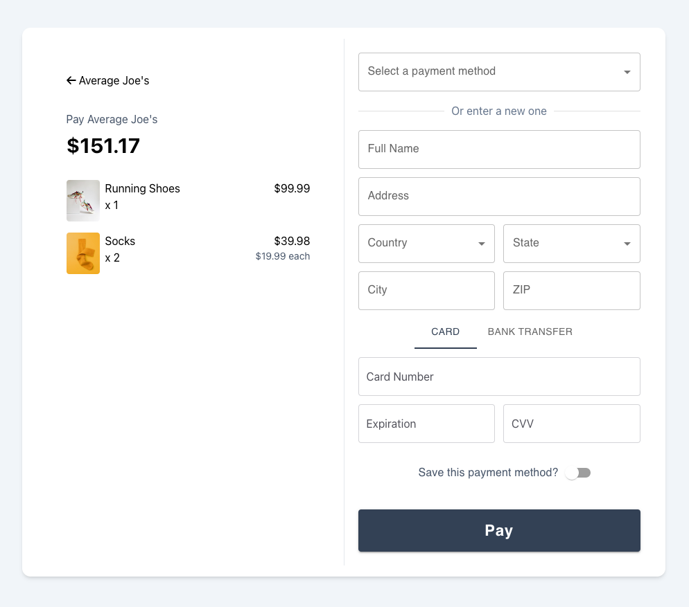

# The Tilled Example Monorepo

This is a public-facing repository of more specific examples to help our Partners implement Tilled.

---

## Table of Contents

1. [Simple Onboarding Form](#simple-onboarding-form)
2. [React Payment Example](#react-payment-example)
3. [React TS Checkout](#react-ts-checkout)
4. [Netlify Apple Pay Example ](/apple-pay-example-netlify/)
5. [ngrok Apple Pay Example](/apple-pay-example-ngrok/)

---

## Simple Onboarding Form

<p align="center">
    
</p>

- **Tech Stack**: HTML, CSS, JavaScript
- **Description**: Two basic forms to create a connected account and update/submit a merchant application. This project was created as starting point for partners that want more control over their merchants' onboarding experience.
- **Get Started**: Open your terminal and run the following command:
  ```
  $ npm run launch-form
  ```
- [Link](/simple-onboarding-form/)

## React Payment Example

<p align="center">
    
</p>

- **Tech Stack**: React, Node/Express
- **Description**: A payment terminal built with `create-react-app`. This project was created to demonstrate a basic implementation of `tilled.js` with React.
- [Link](/react-payment-example/)

## React TS Checkout

<p align="center">
    
</p>

- **Tech Stack**: Typescript, React, Node/Express
- **Description**: A checkout experience built with `Vite`. This project was created to demonstrate the full potential of `tilled.js` with React, Typescript, MUI, and our Node SDK.
- [Link](/react-ts-checkout/)

## Apple Pay Examples

<p align="center">  </p>

You will find two **Apple Pay** examples in this repository, which were created by modifying our [simple-payment-example](https://github.com/gettilled/simple-payment-example). To ensure compliance with **Apple Pay**'s requirements, we have created an example using [Netlify](https://www.netlify.com/) and another that uses [ngrok](https://ngrok.com/).

**Apple Pay** requires that your domain be HTTPS secured with TLS 1.2 or later and that it has a valid SSL certificate. These requirements are verified during the [Domain Verification](https://docs.tilled.com/api/#tag/ApplePayDomains/operation/CreateApplePayDomain) process. Please note that Apple Pay will not function locally.

- **Tech Stack**: HTML, CSS, JavaScript, Node/Express
- **Description**: These examples were created by modifying our [simple-payment-example](https://github.com/gettilled/simple-payment-example). To meet Apple Pay requirements, we've included examples using [Netlify](https://www.netlify.com/) and [ngrok](https://ngrok.com/). Note that Apple Pay requires HTTPS and a valid SSL certificate, verified during [Domain Verification](https://docs.tilled.com/api/#tag/ApplePayDomains/operation/CreateApplePayDomain).

### Apple Pay Example Links

- [Netlify Apple Pay Example ](/apple-pay-example-netlify/)
- [ngrok Apple Pay Example](/apple-pay-example-ngrok/)
