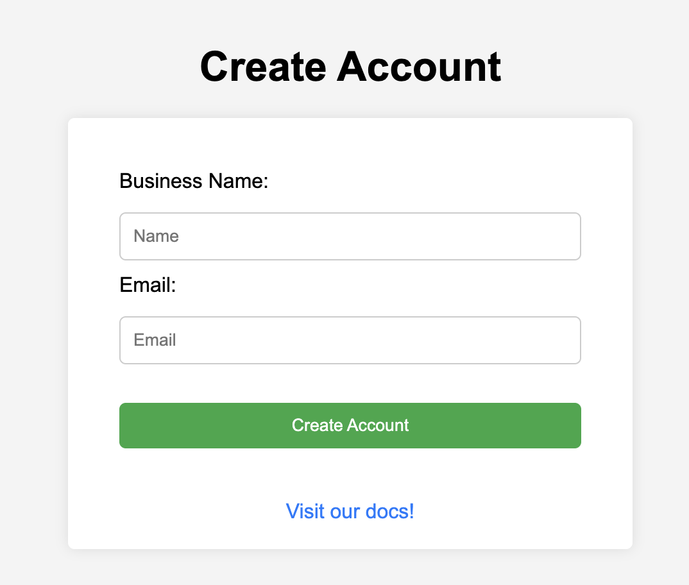
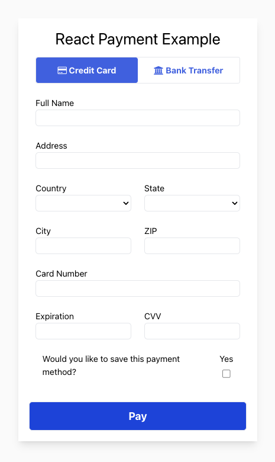

# The Tilled Example Monorepo

This is a public-facing repository of more specific examples to help our Partners implement Tilled. They are **not** intended to be implemented in a production environment nor is it intended to be installed as a dependency in any way.

---

## Table of Contents

1. [Javascript Examples](#javascript-examples)
2. [React Examples](#react-examples)
3. [Laravel Examples](#laravel-examples)
4. [Apple Pay Examples](#apple-pay-examples)
5. [iOS Examples](#ios-examples)
6. [Android Examples](#android-examples)

---

## Javascript Examples

### Create Account and User Invitation

<p align="center">
    

- **Tech Stack**: HTML, CSS, JavaScript/Node
- **Description**: The easiest way to onboard seamlessly through our hosted onboarding form.
- [link](/javascript/create-account-and-user-invitation)

### Simple Payment Example

<p align="center">
    
</p>

- **Tech Stack**: HTML, CSS, JavaScript
- **Description**: A no-frills payments form to help partners understand our Javascript library, Tilled.js.
- **Note**: This project is located in its own repository.
- [Link](https://github.com/gettilled/simple-payment-example)

### Simple Onboarding Form

<p align="center">
    
</p>

- **Tech Stack**: HTML, CSS, JavaScript
- **Description**: Two basic forms to create a connected account and update/submit a merchant application. This project was created as starting point for partners that want more control over their merchants' onboarding experience.
- **Get Started**: Open your terminal and run the following command:
  ```
  $ npm run launch-form
  ```
- [Link](/javascript/simple-onboarding-form/)

## React Examples

### React Payment Example

<p align="center">
    
</p>

- **Tech Stack**: React, Node/Express
- **Description**: A payment terminal built with Vite. This project was created to demonstrate a basic implementation of `tilled.js` with React.
- [Link](/react/react-payment-example/)

### React TS Checkout

<p align="center">
    
</p>

- **Tech Stack**: Typescript, React, Node/Express
- **Description**: A checkout experience built with `Vite`. This project was created to demonstrate the full potential of `tilled.js` with React, Typescript, MUI, and our Node SDK.
- [Link](/react/react-ts-checkout/)

## Laravel Examples

### Laravel PHP Checkout

<p align="center">
    
</p>

- **Tech Stack**: PHP, Composer, Laravel
- **Description**: A payment terminal built with Laravel. This project was created to demonstrate the implementation of `tilled.js` using Laravel's Blade templating engine for the front-end while using Laravel's Controllers, Services, and Routing for the back-end to interact with the Tilled API. This project includes functionality to create, retrieve, attach and reuse payment methods on a checkout page.

### Laravel PHP Reporting

<p align="center">
    
</p>

- **Tech Stack**: PHP, Composer, Laravel
- **Description**: A reporting dashboard built with Laravel. This project was created to demonstrate using Laravel's Blade templating engine for the front-end while using Laravel's Controllers, Services, and Routing for the back-end to interact with the Tilled API. This project includes functionality to retrieve and display data for the following reports:
  - Balance Transactions
  - Payouts
  - Payment Intents
  - Disputes

## Apple Pay Examples

<p align="center">  </p>

You will find two **Apple Pay** examples in this repository, which were created by modifying our [simple-payment-example](https://github.com/gettilled/simple-payment-example). To ensure compliance with **Apple Pay**'s requirements, we have created an example using [Netlify](https://www.netlify.com/) and another that uses [ngrok](https://ngrok.com/).

**Apple Pay** requires that your domain be HTTPS secured with TLS 1.2 or later and that it has a valid SSL certificate. These requirements are verified during the [Domain Verification](https://docs.tilled.com/api/#tag/ApplePayDomains/operation/CreateApplePayDomain) process. Please note that Apple Pay will not function locally.

- **Tech Stack**: HTML, CSS, JavaScript, Node/Express
- **Description**: These examples were created by modifying our [simple-payment-example](https://github.com/gettilled/simple-payment-example). To meet Apple Pay requirements, we've included examples using [Netlify](https://www.netlify.com/) and [ngrok](https://ngrok.com/). Note that Apple Pay requires HTTPS and a valid SSL certificate, verified during [Domain Verification](https://docs.tilled.com/api/#tag/ApplePayDomains/operation/CreateApplePayDomain).

### Apple Pay Example Links

- [Netlify Apple Pay Example](/apple-pay/apple-pay-example-netlify/)
- [ngrok Apple Pay Example](/apple-pay/apple-pay-example-ngrok/)

## iOS Examples

<p align="center">
    
</p>

- **Tech Stack**: SwiftUI, Node/Express
- **Description**: A payment terminal built with SwiftUI. This project was created to demonstrate a basic implementation of a WebView with Tilled's [checkout sessions](https://docs.tilled.com/api/#tag/Checkout-Sessions/operation/CreateCheckoutSession) or a custom `tilled.js` form.
- [Link](/ios/ios-checkout/)

## Android Examples

<!-- markdownlint-disable MD033 -->
<p align="center">
    
</p>

- **Tech Stack**: Kotlin
- **Description**: A POS checkout terminal built with Kotlin to demonstrate the use of Tilled's API to create **[Card Present](https://docs.tilled.com/docs/payments/card-present)** payment methods and payment intents to process payments. A terminal reader provided by Tilled is required for `card_present` payments.
