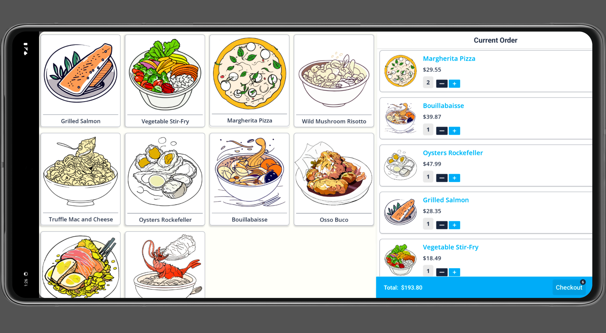

:warning: This repository contains a standalone example to be used as a reference to help our partners integrate with Tilled. It is **not** intended to be implemented in a production environment nor is it intended to be installed as a dependency in any way.

# Android Kotlin POS Checkout Example

# Dependencies

- [Android Studio](https://developer.android.com/studio)
- [Kotlin](https://kotlinlang.org/)
- [Firebase](https://firebase.google.com/)

# Get Started

- Clone the project
- Open the project in Android Studio - `File` > `Open` and select `android-kotlin-pos-checkout` folder
- [Connect the App to Firebase](https://firebase.google.com/docs/database/android/start)
  - The dependencies are already added to the project. You just need to connect the app to Firebase.

# Create a sandbox account and add your configuration values

- Replace the values for the `terminalReaderId`, `tilled-account`, and `tilled-api-key` with your own values in the **[APIConfig.kt](app/src/main/java/com/example/androidcheckout/api/APIConfig.kt)** file.

```kotlin
private const val baseUrl = "https://sandbox-api.tilled.com"
const val terminalReaderId = "term_XXXX" // Replace with your own terminal reader ID
private var retrofit: Retrofit? = null
private val okHttpClient = OkHttpClient.Builder()
    .addInterceptor { chain ->
        val request = chain.request().newBuilder()
            .addHeader("tilled-account", "acct_XXXX") // Replace with your own Account ID
            .addHeader("tilled-api-key", "sk_XXXX") // Replace with your own Secret Key
```

# Running the project in Android Studio

- Open the project in Android Studio - `File` > `Open` and select `android-kotlin-pos-checkout` folder
- Create a Virtual Device - `Tools` > `Device Manager`. On the **Virtual** tab, click **Create Device**
  - For this example, we used the **13.5 Freeform** device with the **Release Name** `API 34`, but you can use any device you want.
- Run the project - Click the Run (`Run 'app'`) button in the toolbar.

# Process your first payment

<p align="center">
  
</p>

- In the app, you will tap the product cards to add them to the cart.
- After adding items to the cart, tap the **Checkout** button.
- The app will then create the `card_present` Payment Method and Payment Intent.
  - After the requests are sent successfully, the app will display an **Awaiting Payment** modal.
  - The terminal will then display the payment amount, with a confirmation prompt. Tap **OK** to confirm the payment, and Tap, Swipe, or Insert the card to process the payment.
    - In this example, we are using checking for the `status` of the payment intent by sending a **[Get a Payment Intent](https://docs.tilled.com/api/#tag/PaymentIntents/operation/GetPaymentIntent)** request every 5 seconds, but in a production environment, you should use **[Webhooks](https://docs.tilled.com/docs/webhooks/about-webhooks)** to achieve this.
  - After the payment is processed, the app will display a modal with the payment status (Success or Failure) and the payment details.
    - If the payment is cancelled, the app will display a modal with the payment status (Cancelled).
