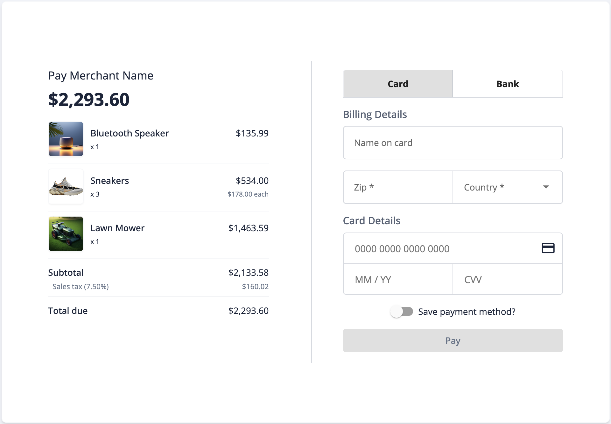
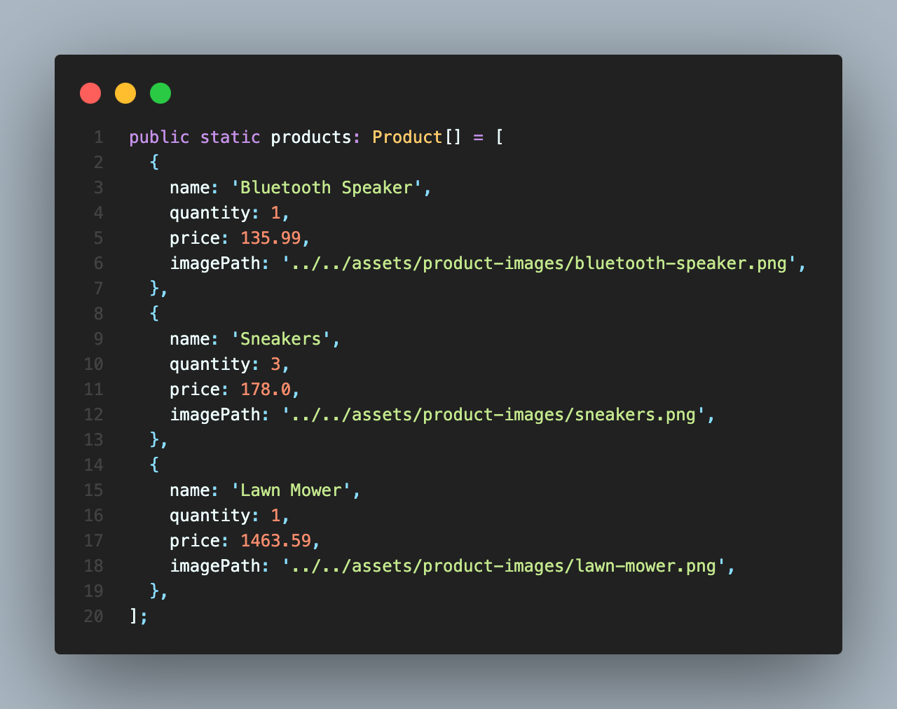

:warning: This repository contains a standalone example to be used as a reference to help our partners integrate with Tilled. It is **not** intended to be implemented in a production environment nor is it intended to be installed as a dependency in any way.

# Dependencies

- [Angular](https://angular.io/)
- [Node.js](https://nodejs.org)
- [TailwindCSS](https://tailwindcss.com/)
- [Angular Material](https://v14.material.angular.io/)
- [tilled-node](https://www.npmjs.com/package/tilled-node)

You can find documentation for `tilled-node` on
[docs.tilled.com](https://docs.tilled.com/resources/sdks/tilled-node/) and
[Github Pages](https://gettilled.github.io/tilled-node/).

# Get started

- Clone the project
- Install dependencies (be sure to navigate to the directory for this project
  `cd angular/angular-checkout`

  ```
  $ npm install
  ```

# Create a sandbox account and add your configuration values

- Create a .env file in this project's root directory (`angular-checkout`) with your secret API key:

```
TILLED_SECRET_KEY=sk_...
```

- In the Angular environment file (`src/environments/environment.ts`), add your merchant's account ID, your publishable API key, and tax rate.

```
  publishableKey: 'pk_...',
  merchantAccountId: 'acct_...',
  taxRate: 0.075, // Add your local tax rate here (e.g. 0.075 for 7.5%)
  merchantName: 'Merchant Name', // (Shown on Checkout Summary `Pay <merchantName>`)
```

# Start your backend and client

- Enter the following command from this project's root:

```
$ npm run dev
```

# Process your first payment

<p align="center">
  
</p>

- Navigate to [http://localhost:4200](http://localhost:4200) in your browser,
  fill out the billing details, enter `4037111111000000` as the test card
  number with a valid expiration date and `123` as the CVV Code and click Pay
- Optional: Look in the browser's developer console to see payment intent
  creation logs
- Go [here](https://sandbox-app.tilled.com/payments) to see your payment

# Updating the Cart

The cart is hard-coded in the [ProductsList](/src/app/utils/products-list.ts) class for simplicity and used by the Checkout component to display each product in a table and calculates the subtotal, tax, and total. The table displays the product name, image, quantity, and price.

<p align="center">
  
</p>

# TilledService

This service is responsible for loading the Tilled.js script, initializing the form, and setting up the fields. It also handles methods for creating a payment method and confirming a payment.

The `TilledFieldsService` is used here to set up the fields and field event listeners. This is where the field options and placeholder text are set.