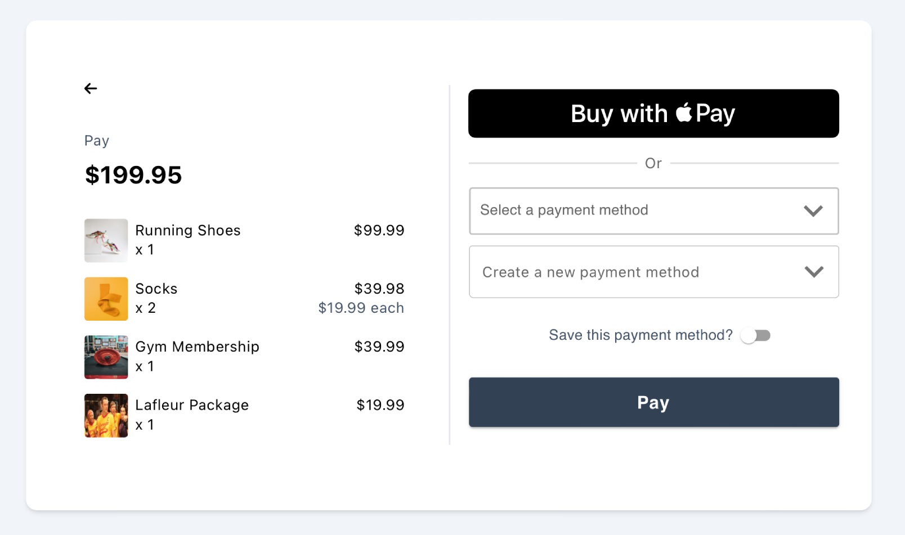
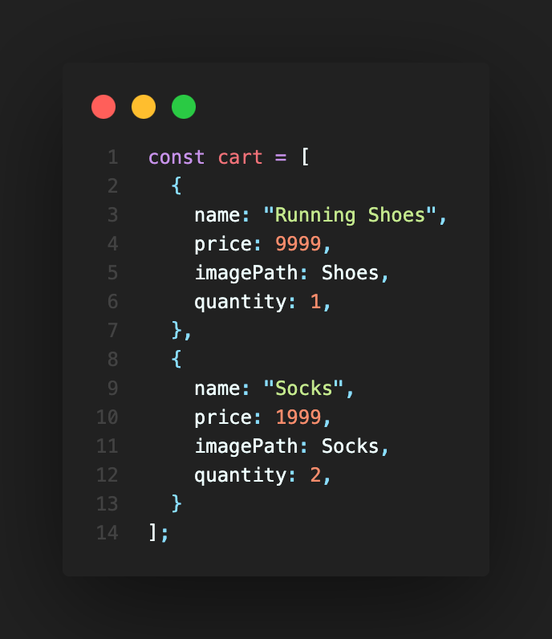
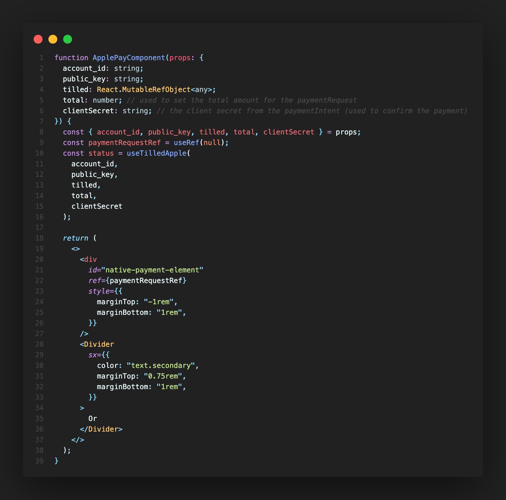
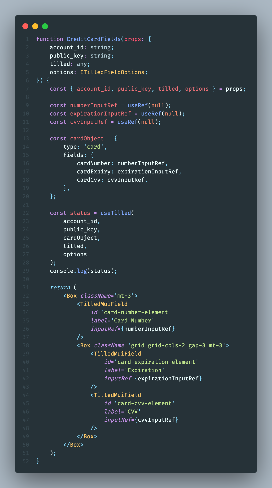

# Dependencies

-   [Vite](https://create-react-app.dev/)
-   [Node.js](https://nodejs.org)
-   [TailwindCSS](https://tailwindcss.com/)
-   [Material UI](https://mui.com/)

# Get started

-   Clone the project
-  Sign up for [Netlify](https://www.netlify.com/) and set up the Payment Example on your site
	- [Sign up for Netlify](https://app.netlify.com/signup)
	- [Import your cloned GitHub repository and create a new site](https://app.netlify.com/start)

# Create a sandbox account and add your configuration values
-   Add the environment variables below to the Environment Variables section of your Netlify. (i.e https://app.netlify.com/sites/SITES-NAME-HERE/settings/env). Make sure to replace the values with your own.
```
TILLED_SECRET_KEY=sk_XXXX
VITE_TILLED_PUBLIC_KEY=pk_XXXX
VITE_TILLED_ACCOUNT_ID=acct_XXXX
VITE_TILLED_CUSTOMER_ID=cus_XXXX // needed if you want to save and use saved payment methods
VITE_TILLED_MERCHANT_NAME=Merchant's Name // use your merchant's name in the checkout summary
VITE_TILLED_MERCHANT_TAX = 1.08 // add the sales tax for your merchant
```

_Note: Vite environment variables must be prefixed with `VITE_` and they must be
included in a separate .env file in the client directory to work properly.\_

- [Create an Apple Developer Account](https://developer.apple.com/programs/enroll/) _(this will be used when testing Apple Pay on your Website)_
  - On your Apple Developer Account, [create a Sandbox Tester Account](https://developer.apple.com/apple-pay/sandbox-testing/#:~:text=supports%20TLS%201.2.-,Create%20a%20Sandbox%20Tester%20Account,-To%20create%20a).
  - Sign in to your Sandbox Tester Account on a [Compatible Device](https://support.apple.com/en-us/HT208531) you would like to test out your integration on.
  - Once you are signed in, you will [add a Test Card Number to your Apple Pay Wallet](https://developer.apple.com/apple-pay/sandbox-testing/#:~:text=Adding%20a%20Test%20Card%20Number) using one of the [Test Cards provided by Apple.](https://developer.apple.com/apple-pay/sandbox-testing/#:~:text=Test%20Cards%20for%20Apps%20and%20the%20Web)

-  Sign up and download [ngrok](https://ngrok.com/):
    - [Sign up for ngrok](https://dashboard.ngrok.com/signup)
    - [Download ngrok](https://ngrok.com/download)
    - [Setup & Installation for ngrok](https://dashboard.ngrok.com/get-started/setup)

# Deploying to Netlify
Follow the instructions below to deploy your site to Netlify site if it is not already deployed
- https://www.netlify.com/blog/2016/09/29/a-step-by-step-guide-deploying-on-netlify/

### Domain Verification

> #### **:warning: Important to note::warning:**
> Apple's Documentation for [Apple Pay on the Web](https://developer.apple.com/documentation/apple_pay_on_the_web) instructs you to create a Merchant Identifier, Payment Processing Certificate, and to Register your Domain through them. Tilled takes care of all of this on your behalf when you [verify your Domain through our API](https://docs.tilled.com/api#tag/ApplePayDomains/operation/CreateApplePayDomain) using our [Apple Domain Verification File](https://api.tilled.com/apple-developer-merchantid-domain-association).

You must register and verify all top-level domains and subdomains where you will display the Apple Pay button. For example, if you were to host a Payment Form that displays the Apple Pay button on `https://pay.example.com/` and `https://example.com/`, you will need to complete Domain Verification for both.

---
> #### **:warning: Important to note::warning:**
>In the Production environment, to receive your Domain Verification files for Apple Pay, you will need to reach out to the Onboarding Team at [integrations@tilled.com](integrations@tilled.com) and provide the following information:
>
>1.  On how many domains do you plan to host the Apple Pay button?
    -   If each Merchant will be using a different domain or subdomain, you will need to include that in your answer if the Merchant will be hosting the Apple Pay button.
    -   You will need to register and verify all top-level domains and subdomains where you will display the Apple Pay button. For example, if you were to host a payment form that displayed the Apple Pay button on  `https://pay.example.com/`  and  `https://example.com/`, you would need to complete domain verification for both.  
>
>2.  How many merchants are you planning to enable Apple Pay for?  
>
> 3.  Will you be using your own payment/checkout page (using Tilled.js) or Tilled’s Checkout Sessions?

<hr>

### Verifying your Domain for Apple Pay

1. In this example, we have already added [**Tilled's Apple Domain Verification File**](https://api.tilled.com/apple-developer-merchantid-domain-association) and it should be reachable at `/.well-known/apple-developer-merchantid-domain-association` in the domain path.

- Make sure the file is accessible in your domain at `https://YOURDOMAIN.com/.well-known/apple-developer-merchantid-domain-association`. The page should either show the contents of what is shown [here](.well-known/apple-developer-merchantid-domain-association) or the file should be automatically downloaded when visiting the page.

2. After confirming that your file is being hosted and is accessible, you will need to utilize Tilled's API to [**Create an Apple Domain**](https://docs.tilled.com/api#tag/ApplePayDomains), which will verify the Domain through Apple.

<p align="center">

<strong>Example: POST /v1/apple-pay-domains Request</strong>

</p>

```curl
$ curl -X POST 'https://sandbox-api.tilled.com/v1/apple-pay-domains' \
-H 'tilled-account: {{MERCHANT_ACCOUNT_ID}}' \
-H 'tilled-api-key: {{SECRET_KEY}}' \
-H 'Content-Type: application/json' \
--data-raw '{"hostname": "https://example.com"}'
```
<p  align  ="center">
<strong>Example: POST /v1/apple-pay-domains Response</strong>
</p>

```json
{
"updated_at": "2019-08-24T14:15:22Z",
"created_at": "2019-08-24T14:15:22Z",
"id": "string",
"hostname": "string",
"account_id": "string"
}
```
3. After successful Domain Verification, you are now able to start accepting Payments on your site.

---
# Paying with Apple Pay
<p align="center">
  
</p>
After completing the steps above, you will follow the instructions below to access your publicly facing domain where the server is being hosted:

1.  [Sign in to your Apple Sandbox Tester Account on the device you are using](https://support.apple.com/en-us/HT204053)
	- If you haven't already, use [Apple's Test Cards](Apple%27s%20Test%20Cards) to [add a card to your Apple Pay Wallet](https://support.apple.com/en-us/HT204506)
2. In Safari, open the link to your publicly-facing domain where the example is being hosted.
	- ** _<u>you are not able to make payments with Apple Pay in localhost_</u> **
3. Click the **Buy with Pay** Button under Pay with Card.
	- Authorize the payment through the Apple Pay pop-up.
	- `Optional: Look in the browser's developer console to see payment intent creation logs`
4. Go [here](https://sandbox-app.tilled.com/payments) to see your payment


# Updating the Cart
The Checkout component takes a single property, `cart`. The cart is hard-coded in [App.tsx](./client/src/App.tsx).
<p align="center">
  
</p>

# useTilledApple
This hook was created to offer the same functionality as the useTilled hook, but for Apple Pay. This hook also handles The PaymentIntent confirmation and the PaymentMethod creation, as well as the paymentRequest functionality for Apple Pay.

## Parameters
```typescript
  account_id: string,
  public_key: string,
  tilled: React.MutableRefObject<any>,
  total: number, // adds the total to the paymentRequest
  clientSecret: any // the client secret from the paymentIntent
```
- `account_id`: the Tilled merchant account id. Ex: acct_XXXX
- `public_key`: publishable Tilled API key. Ex: pk_XXXX
- `total`: the total amount of the transaction (This is passed from the cart)
- `clientSecret`: the client secret from the paymentIntent

## Functionality

This hook can be called from inside the component containing the Apple Pay button. It will create the paymentRequest and the paymentMethod. It will also confirm the paymentIntent and return the paymentIntent object.

It does the following:
- Creates a new Tilled instance
- Awaits a new form instance
- Determines if the browser supports Apple Pay
  - If it does, it creates a new paymentRequest and injects the the Apple Pay button into the DOM
- Builds the form (injects the Apple Pay button), as the useTilled hook injects the card and bank fields

## Usage
Invoke the hook from inside the component containing your Apple Pay component.

<p align="center">
  
</p>

---

# useTilled
This hook was created to make this example more reactive and to make it easier
for Tilled partners to get up and running with Tilled. This version is written
in Typescript.

## Parameters

```typescript
account_id: string,
public_key: string,
paymentTypeObj: {
    type: string,
    fields: {
        cardNumber?: React.MutableRefObject<any>,
        cardExpiry?: React.MutableRefObject<any>,
        cardCvv?: React.MutableRefObject<any>,
        bankRoutingNumber?: React.MutableRefObject<any>,
        bankAccountNumber?: React.MutableRefObject<any>
    },
    cardBrandIcon?: React.MutableRefObject<any>
},
tilled: React.MutableRefObject<any>,
options: ITilledFieldOptions
```

- `account_id`: the Tilled merchant account id. Ex: acct_XXXX
- `public_key`: publishable Tilled API key. Ex: pk_XXXX
- `paymentTypeObj`: an object with the payment method type and object describing the fields to be injected. Ex:

```typescript
const cardObject = {
  type: "card",
  fields: {
    cardNumber: numberInputRef,
    cardExpiry: expirationInputRef,
    cardCvv: cvvInputRef,
  },
};
```

- `fieldOptions`: The Tilled.js form [options object](https://docs.tilled.com/tilledjs/#formcreatefieldformfieldtype-options-formfield) as well as option on focus/blur callbacks. Ex:

```typescript
const TilledFieldOptions = {
  fieldOptions: {
    styles: {
      base: {
        fontFamily:
          '-apple-system, "system-ui", "Segoe UI", Roboto, Oxygen, Ubuntu, Cantarell, "Fira Sans", "Droid Sans", "Helvetica Neue", sans-serif',
        color: "#304166",
        fontWeight: "400",
        fontSize: "16px",
      },
      invalid: {
        ":hover": {
          textDecoration: "underline dotted red",
        },
        color: "#777777",
      },
      valid: {
        color: "#32CD32",
      },
    },
  },
  onFocus(field: { element: Element }) {
    const element = field.element;
    const label = element.nextElementSibling;

    element.classList.add("border-slate-700");
    element.classList.add("border-2");
    label?.classList.add("text-slate-700");
    label?.classList.add("top-0");
    label?.classList.add("text-xs");

    element.classList.remove("border-zinc-300");
    element.classList.remove("border");
    element.classList.remove("hover:border-zinc-500");
    label?.classList.remove("text-zinc-600");
    label?.classList.remove("top-1/2");
  },
  onBlur(field: { element: Element; empty: boolean }) {
    const { element, empty } = field;
    const label = element.nextElementSibling;

    element.classList.add("border-zinc-300");
    element.classList.add("border");
    element.classList.add("hover:border-zinc-500");
    label?.classList.add("text-zinc-600");

    element.classList.remove("border-slate-700");
    element.classList.remove("border-2");
    label?.classList.remove("text-slate-700");

    if (empty) {
      label?.classList.add("top-1/2");
      label?.classList.remove("top-0");
      label?.classList.remove("text-xs");
    }
  },
};
```

## Functionality

This hook can be called from inside the component containing the Tilled.js
fields and uses the `useScript` hook to insert the Tilled.js script into the
DOM. When the component it's called from mounts, it waits until the script is
ready and then does the following:

- Creates a new Tilled instance
- Awaits a new form instance
- Loops through and inject the `paymentTypeObj.fields`
- Builds the form

Once the component unmounts, it checks to see if a form exists and runs the
[teardown method](https://docs.tilled.com/tilledjs/#formteardownhandler-promiseboolean--void)
and returns a status message.

## Usage

Invoke the hook from inside the component containing your Tilled.js fields:

<p align="center">
  
</p>

# Other helpful notes

- A tilled ref is created in the Checkout component with separate tilled
  instances for card and ach_debit. These instances are a sort of shared state between the fields components (ach-debit-fields.tsx and credit-card-fields.tsx) and App.tsx (specifically the submit logic). `confirmPayment` and `createPaymentMethod` are methods of the tilled instances created with `useTilled`. Therefore, the ref needs to be lifted to their closest common ancestor, App.js. For more information on lifting state, visit the [Lifting State Up](https://reactjs.org/docs/lifting-state-up.html) page in React's documentation.
- By design, Tilled.js inserts iFrames into the DOM for PCI compliance. The values therein **cannot** be accessed by your client-side code. Running the teardown function, as demonstrated in `useTilled` **will** delete the form instance and the values stored in its respective iFrames. This will prevent duplicate form inputs that could result in difficult to troubleshoot errors.