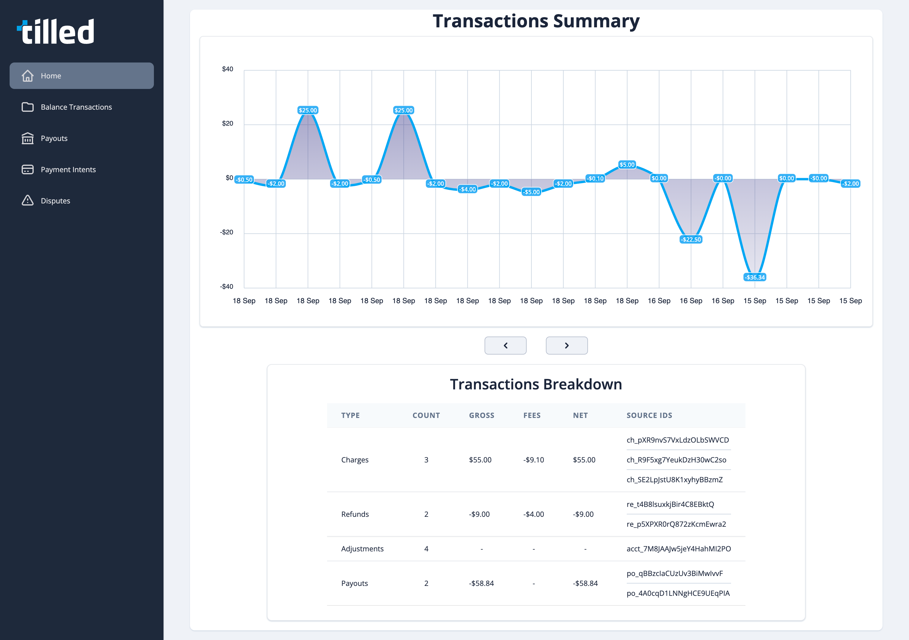

:warning: This repository contains a standalone example to be used as a reference to help our partners integrate with Tilled. It is **not** intended to be implemented in a production environment nor is it intended to be installed as a dependency in any way.

# Dependencies

- [PHP](https://www.php.net/downloads.php)
- [Composer](https://getcomposer.org/download/)
- [Laravel](https://laravel.com/docs/installation)

# Get started

- Clone the project
- Install dependencies *be sure to run this command from the* `laravel/laravel-php-reporting` *directory*:

  ```bash
  $ composer install
  ```

# Create a sandbox account and add your configuration values

- Create a .env file in this project's root directory `laravel-php-reporting` with your Secret API Key, Merchant Account ID, and a blank value for `APP_KEY`:

  ```env
  # Leave this blank, it will be generated for you when `php artisan key:generate` is run
  APP_KEY =

  # Tilled Credentials
  # Tilled Merchant Account ID
  TILLED_ACCOUNT_ID=acct_...
  # Tilled Secret API Key
  TILLED_SECRET_KEY=sk_...
  ```

- After creating the .env file, in this project's root, run the following command to generate the key value for `APP_KEY`:

  ```bash
  $ php artisan key:generate
  ```

# Run the Laravel server

- Enter the following command from this project's root:

  ```bash
  $ php artisan serve
  ```

# View the reports in your browser

<p align="center">
  
</p>

- Open your web browser and go to [http://localhost:8000](http://localhost:8000/).
  - This will bring you to the **Transactions Summary** page, which will display a chart along with a table of the last 20 transactions. You can use the next and previous buttons to navigate through the pages of transactions.
  - The sidebar on the left will allow you to navigate to the different reports.
    - **Balance Transactions**
    - **Payouts**
    - **Payment Intents**
    - **Disputes**
  - Each of these reports will display a table of the last 15 items. You can use the next and previous buttons to navigate through the pages of items.
  - These reports will only display items for the Merchant Account ID that you entered in the .env file.

# What's Next?

- [Tilled Docs](https://docs.tilled.com/docs)
- [Tilled.js Docs](https://docs.tilled.com/docs/payment-methods/tilledjs/)
- [API Docs](https://docs.tilled.com/api)
- [Partner Help Center](https://tilledpartners.zendesk.com/hc/en-us)