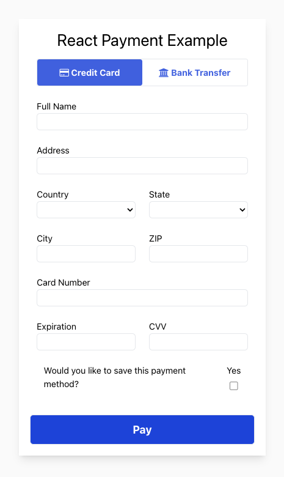
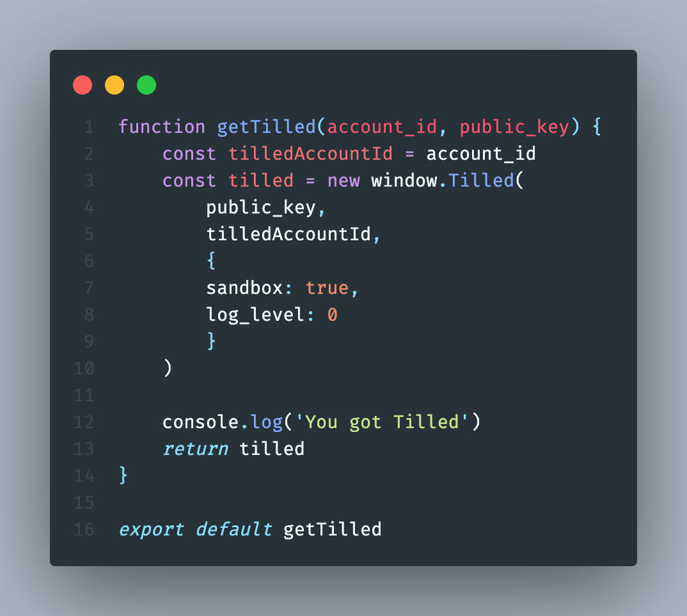
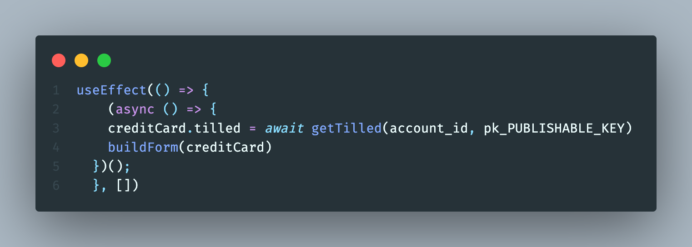
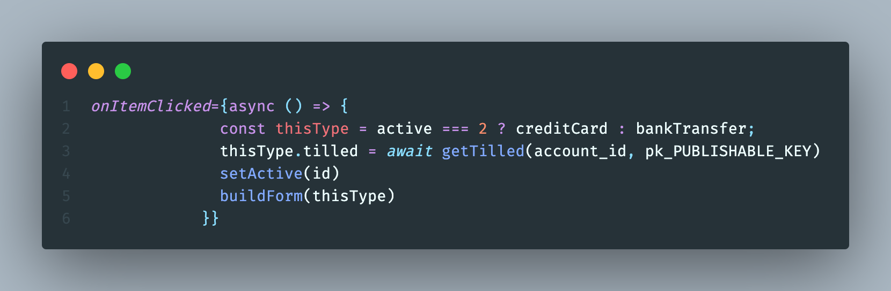

# Dependencies

- [Create-React-App](https://create-react-app.dev/)
- [Node.js](https://nodejs.org)
- [TailwindCSS](https://tailwindcss.com/)

# Get started

- Clone the project
- Install dependencies (be sure to navigate to the directory for this project `cd react-payment-example`):
  ```
  $ npm install
  $ cd client && npm install
  ```
# Create a sandbox account and add your configuration values

- Create a .env file in this project's root directory (`react-payment-example`) with your secret API key:

```
TILLED_SECRET_KEY=sk_XXXX
```
- Create a second .env file in the client directory (`react-payment-example/client`) with your merchant's `account_id` and your publishable API key.
```
REACT_APP_TILLED_PUBLIC_KEY=pk_XXXX
REACT_APP_TILLED_ACCOUNT_ID=acct_XXXX
```

_Note: React environment variables must be prefixed with `REACT_APP_` and they must be included in a separate .env file in the client directory to work properly._

# Start your backend and client servers

- First, enter the following command to start your backend server (`react-payment-example/server/index.js`) from this project's root:
```
$ npm run start-server
```
- Next, start the Create React App server:
```
$ npm run start-client
```

# Process your first payment
<p align="center">
  
</p>

- Navigate to [http://localhost:5000](http://localhost:3000) in your browser, enter `4037111111000000` as the test card number with a valid expiration date and `123` as the CVV Code and click Pay
- Optional: Look in the browser's developer console to see payment intent creation logs
- Go [here](https://sandbox-app.tilled.com/payments) to see your payment

# Other helpful notes
- This project loads a script tag in the head of [index.html](client/public/index.html) and creates a `Tilled` instance using the `Window` in interface in [getTilled.js](client/src/hooks/getTilled.js) like so:
<p align="center">
  
</p>

- Separate `Tilled` and `form` instances were created for each payment method type. Using a single form instance can lead to errors pertaining to incorrect payment method `types` and unnecessary `form` fields while using conditional rendering. See [App.js](client/src/App.js):
<p style="display: flex; gap:10px; justify-content: space-between;">
  
  
</p>