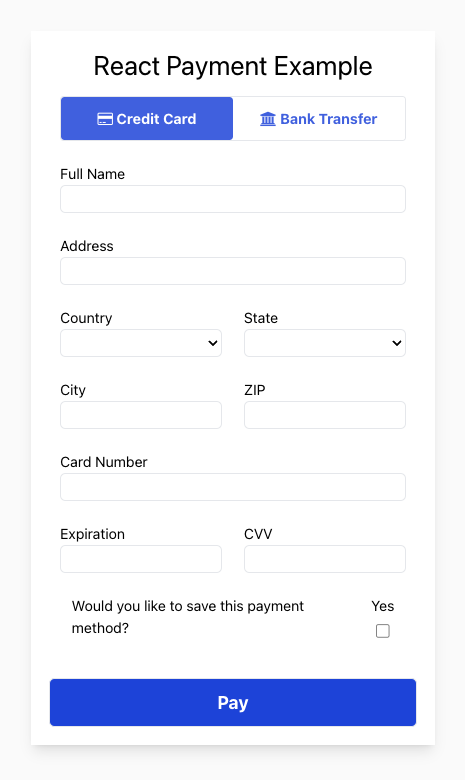
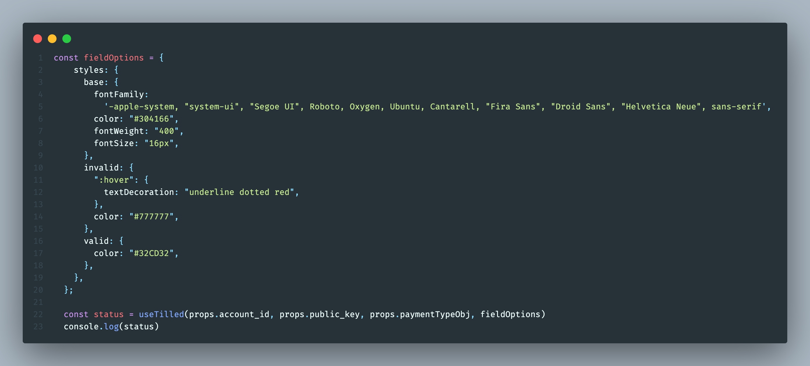

:warning: This repository contains a standalone example to be used as a reference to help our partners integrate with Tilled. It is **not** intended to be implemented in a production environment nor is it intended to be installed as a dependency in any way.

# Dependencies

- [Vite](https://vitejs.dev/)
- [Node.js](https://nodejs.org)
- [TailwindCSS](https://tailwindcss.com/)

# Get started

- Clone the project
- Install dependencies (be sure to navigate to the directory for this project `cd react/react-payment-example`):
  ```
  $ npm install
  $ cd client && npm install
  ```

# Create a sandbox account and add your configuration values

- Create a .env file in this project's root directory (`react-payment-example`) with your secret API key:

```
TILLED_SECRET_KEY=sk_XXXX
```

- Create a second .env file in the client directory (`react-payment-example/client`) with your merchant's `account_id` and your publishable API key.

```
REACT_APP_TILLED_PUBLIC_KEY=pk_XXXX
REACT_APP_TILLED_ACCOUNT_ID=acct_XXXX
```

_Note: React environment variables must be prefixed with `REACT_APP_` and they must be included in a separate .env file in the client directory to work properly.\_

# Start your backend and client servers

- First, enter the following command to start your backend server (`react-payment-example/server/index.js`) from this project's root:

```
$ npm run start-server
```

- Next, start the Vite App server:

```
$ npm run start-client
```

# Process your first payment

<p align="center">
  
</p>

- Navigate to [http://localhost:5000](http://localhost:3000) in your browser, enter `4037111111000000` as the test card number with a valid expiration date and `123` as the CVV Code and click Pay
- Optional: Look in the browser's developer console to see payment intent creation logs
- Go [here](https://sandbox-app.tilled.com/payments) to see your payment

# useTilled

This hook was created to make this example more reactive and to make it easier for Tilled partners to get up and running with Tilled.

## Parameters

`account_id`: the Tilled merchant account id. Ex: acct_XXXX
`public_key`: publishable Tilled API key. Ex: pk_XXXX
`paymentTypeObj`: an object with the payment method type and and object describing the fields to be injected. Ex:

```
creditCard: {
    type: 'card',
    fields: {
      cardNumber: "#card-number-element",
      cardExpiry: "#card-expiration-element",
      cardCvv: "#card-cvv-element",
    }
  }
```

`fieldOptions`: The Tilled.js form [options object](https://docs.tilled.com/tilledjs/#formcreatefieldformfieldtype-options-formfield). Ex:

```
const fieldOptions = {
    styles: {
      base: {
        fontFamily:
          '-apple-system, "system-ui", "Segoe UI", Roboto, Oxygen, Ubuntu, Cantarell, "Fira Sans", "Droid Sans", "Helvetica Neue", sans-serif',
        color: "#304166",
        fontWeight: "400",
        fontSize: "16px",
      },
      invalid: {
        ":hover": {
          textDecoration: "underline dotted red",
        },
        color: "#777777",
      },
      valid: {
        color: "#32CD32",
      },
    },
  };
```

## Funtionality

This hook can be called from inside the component containing the Tilled.js fields and uses the `useScript` hook to insert the Tilled.js script into the DOM. When the component it's called from mounts, it waits until the script is ready and then does the following:

- Creates a new Tilled instance
- Awaits a new form instance
- Loops through and inject the `paymentTypeObj.fields`
- Updates the card brand if the DOM contains and element with the `#card-brand-icon` selector
- Builds the form

Once the component unmounts, it checks to see if a form exists and runs the [teardown method](https://docs.tilled.com/tilledjs/#formteardownhandler-promiseboolean--void) and returns a status message.

## Usage

Invoke the hook from inside the component containing your Tilled.js fields:


<p align="center">
  
</p>

# Other helpful notes

- The `paymentMethodTypes` variable in App.js reflects the app's state, shared by the fields components (ach-debit-fields.js and credit-card-fields.js) and App.js (specifically the submit button that calls `confirmPayment`). `confirmPayment` needs access to the form instance created with `useTilled`. therefore, it needs to be lifted to their closest common ancestor, App.js. For more information on lifting state, visit the [Lifting State Up](https://reactjs.org/docs/lifting-state-up.html) page in React's documentation.
- By design, Tilled.js inserts iFrames into the DOM for PCI compliance. The values therin **cannot** be accessed by your client-side code. Running the teardown when components unmount, as demonstrated in `useTilled` **will** delete the form instance and the values stored in its respective iFrames.
<!-- - (Deprecated) This project loads a script tag in the head of [index.html](client/public/index.html) and creates a `Tilled` instance using the `Window` in interface in [getTilled.js](client/src/hooks/getTilled.js) like so:
<p align="center">
  
</p>


- (Deprecated) Separate `Tilled` and `form` instances were created for each payment method type. Using a single form instance can lead to errors pertaining to incorrect payment method `types` and unnecessary `form` fields while using conditional rendering. See [App.js](client/src/App.js):
<p style="display: flex; gap:10px; justify-content: space-between;">
  
  
</p> -->
