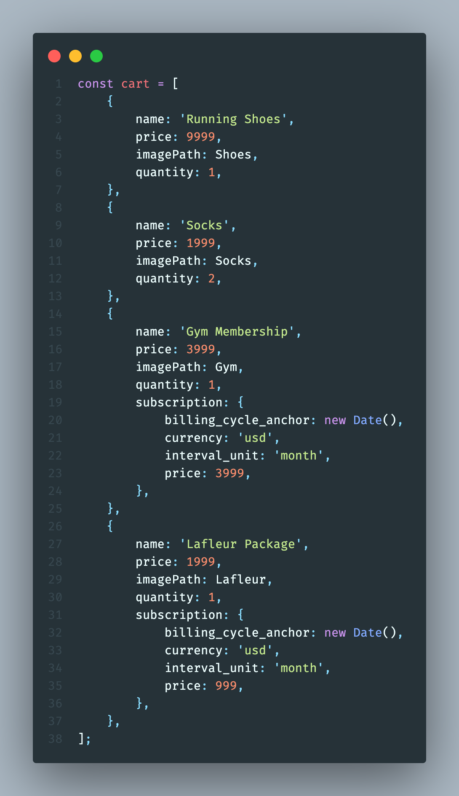
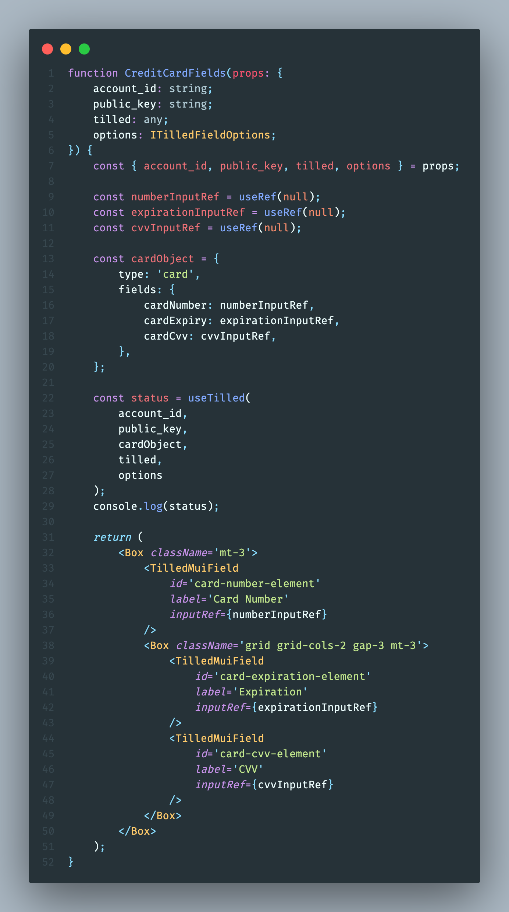

:warning: This repository contains a standalone example to be used as a reference to help our partners integrate with Tilled. It is **not** intended to be implemented in a production environment nor is it intended to be installed as a dependency in any way.

# Dependencies

- [Vite](https://vitejs.dev/)
- [Node.js](https://nodejs.org)
- [TailwindCSS](https://tailwindcss.com/)
- [Material UI](https://mui.com/)
- [tilled-node](https://www.npmjs.com/package/tilled-node)

You can find documentation for `tilled-node` on
[docs.tilled.com](https://docs.tilled.com/resources/sdks/tilled-node/) and
[Github Pages](https://gettilled.github.io/tilled-node/).

# Get started

- Clone the project
- Install dependencies (be sure to navigate to the directory for this project
  `cd react/react-ts-checkout`):
  ```
  $ npm install
  $ cd client && npm install
  ```

# Create a sandbox account and add your configuration values

- Create a .env file in this project's root directory (`react-ts-checkout`)
  with your secret API key:

```
TILLED_SECRET_KEY=sk_XXXX
```

- Create a second .env file in the client directory
  (`react-ts-checkout/client`) with your merchant's `account_id` and your
  publishable API key.

```
VITE_TILLED_PUBLIC_KEY=pk_XXXX
VITE_TILLED_MERCHANT_ACCOUNT_ID=acct_XXXX
VITE_TILLED_CUSTOMER_ID=cus_XXXX // needed if you want to save and use saved payment methods
VITE_TILLED_MERCHANT_NAME=Merchant's Name // use your merchant's name in the checkout summary
VITE_TILLED_MERCHANT_TAX = 1.08 // add the sales tax for your merchant
```

_Note: Vite environment variables must be prefixed with `VITE_` and they must be
included in a separate .env file in the client directory to work properly.\_

# Start your backend and client servers

- Enter the following command from this project's root:

```
$ npm run dev
```

# Process your first payment

<p align="center">
  
</p>

- Navigate to [http://localhost:5173](http://localhost:5173) in your browser,
  fill out the billing details, enter `4037111111000000` as the test card
  number with a valid expiration date and `123` as the CVV Code and click Pay
- Optional: Look in the browser's developer console to see payment intent
  creation logs
- Go [here](https://sandbox-app.tilled.com/payments) to see your payment

# Updating the Cart

The Checkout component takes a single property, `cart`. The cart is hard-coded
in
[App.tsx](https://github.com/gettilled/tilled-example-monorepo/blob/react-ts-checkout/react-ts-checkout/client/src/App.tsx)
for simplicity. The optional property, `subscription`, contains subscription
data; if included, it will create a separate subscription for that item. Ex:

<p align="center">
  
</p>

# useTilled

This hook was created to make this example more reactive and to make it easier
for Tilled partners to get up and running with Tilled. This version is written
in Typescript.

## Parameters

```typescript
account_id: string,
public_key: string,
paymentTypeObj: {
    type: string,
    fields: {
        cardNumber?: React.MutableRefObject<any>,
        cardExpiry?: React.MutableRefObject<any>,
        cardCvv?: React.MutableRefObject<any>,
        bankRoutingNumber?: React.MutableRefObject<any>,
        bankAccountNumber?: React.MutableRefObject<any>
    },
    cardBrandIcon?: React.MutableRefObject<any>
},
tilled: React.MutableRefObject<any>,
options: ITilledFieldOptions
```

- `account_id`: the Tilled merchant account id. Ex: acct_XXXX
- `public_key`: publishable Tilled API key. Ex: pk_XXXX
- `paymentTypeObj`: an object with the payment method type and and object
  describing the fields to be injected. Ex:

```typescript
const cardObject = {
	type: 'card',
	fields: {
		cardNumber: numberInputRef,
		cardExpiry: expirationInputRef,
		cardCvv: cvvInputRef,
	},
};
```

- `fieldOptions`: The Tilled.js form
  [options object](https://docs.tilled.com/tilledjs/#formcreatefieldformfieldtype-options-formfield)
  as well as option on focus/blur callbacks. Ex:

```typescript
const TilledFieldOptions = {
	fieldOptions: {
		styles: {
			base: {
				fontFamily:
					'-apple-system, "system-ui", "Segoe UI", Roboto, Oxygen, Ubuntu, Cantarell, "Fira Sans", "Droid Sans", "Helvetica Neue", sans-serif',
				color: '#304166',
				fontWeight: '400',
				fontSize: '16px',
			},
			invalid: {
				':hover': {
					textDecoration: 'underline dotted red',
				},
				color: '#777777',
			},
			valid: {
				color: '#32CD32',
			},
		},
	},
	onFocus(field: { element: Element }) {
		const element = field.element;
		const label = element.nextElementSibling;

		element.classList.add('border-slate-700');
		element.classList.add('border-2');
		label?.classList.add('text-slate-700');
		label?.classList.add('top-0');
		label?.classList.add('text-xs');

		element.classList.remove('border-zinc-300');
		element.classList.remove('border');
		element.classList.remove('hover:border-zinc-500');
		label?.classList.remove('text-zinc-600');
		label?.classList.remove('top-1/2');
	},
	onBlur(field: { element: Element; empty: boolean }) {
		const { element, empty } = field;
		const label = element.nextElementSibling;

		element.classList.add('border-zinc-300');
		element.classList.add('border');
		element.classList.add('hover:border-zinc-500');
		label?.classList.add('text-zinc-600');

		element.classList.remove('border-slate-700');
		element.classList.remove('border-2');
		label?.classList.remove('text-slate-700');

		if (empty) {
			label?.classList.add('top-1/2');
			label?.classList.remove('top-0');
			label?.classList.remove('text-xs');
		}
	},
};
```

## Functionality

This hook can be called from inside the component containing the Tilled.js
fields and uses the `useScript` hook to insert the Tilled.js script into the
DOM. When the component it's called from mounts, it waits until the script is
ready and then does the following:

- Creates a new Tilled instance
- Awaits a new form instance
- Loops through and inject the `paymentTypeObj.fields`
- Builds the form

Once the component unmounts, it checks to see if a form exists and runs the
[teardown method](https://docs.tilled.com/tilledjs/#formteardownhandler-promiseboolean--void)
and returns a status message.

## Usage

Invoke the hook from inside the component containing your Tilled.js fields:

<p align="center">
  
</p>

# Other helpful notes

- A tilled ref is created in the Checkout component with separate tilled
  instances for card and ach_debit. These instances are a sort of shared state
  between the fields components (ach-debit-fields.tsx and
  credit-card-fields.tsx) and App.tsx (specifically the submit logic).
  `confirmPayment` and `createPaymentMethod` are methods of the tilled
  instances created with `useTilled`. Therefore, the ref needs to be lifted to
  their closest common ancestor, App.js. For more information on lifting
  state, visit the
  [Lifting State Up](https://reactjs.org/docs/lifting-state-up.html) page in
  React's documentation.
- By design, Tilled.js inserts iFrames into the DOM for PCI compliance. The
  values therein **cannot** be accessed by your client-side code. Running the
  teardown function, as demonstrated in `useTilled` **will** delete the form
  instance and the values stored in its respective iFrames. This will prevent
  duplicate form inputs that could result in difficult to troubleshoot errors.
