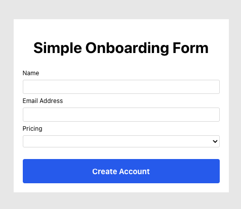
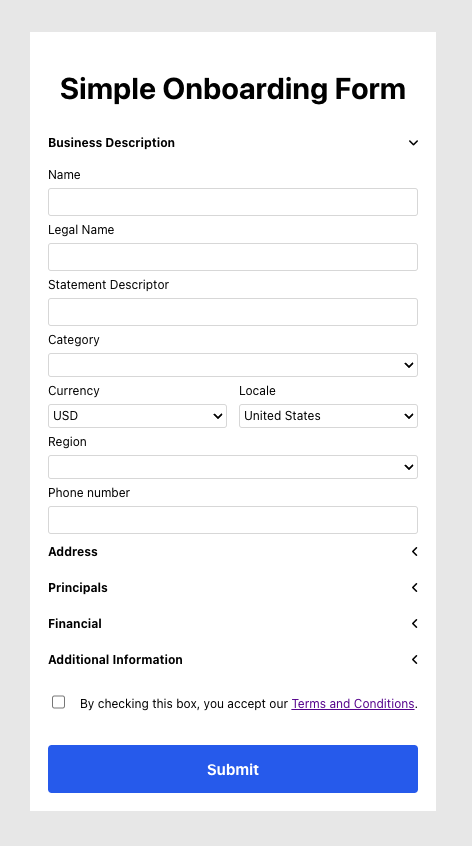

# Dependencies

- [Node.js](https://nodejs.org)

# Get started

- Clone the project
- Install dependencies:
  ```
  $ npm install
  ```

# Create a sandbox account and add your configuration values

- Create a .env file in this project's root directory (`simple-onboarding-form`) with your partner
  `account_id` and your secret API key:

```
PARTNER_ACCOUNT_ID=acct_XXXX
TILLED_SECRET_KEY=sk_XXXX
```

_Note: If you have not created a sandbox account or API keys, please review our
[Initial Setup](https://docs.tilled.com/get-started-with-tilled/initial-setup)
page._

- Run the sample server (from the project root):

  ```
  $ node app.js
  ```

  or, to enable live reload:

  ```
  $ npm run live
  ```

# Create a connected account

<p align="center">
  
</p>

- Navigate to [http://localhost:7070](http://localhost:7070) in your browser,
  fill out the name and email fields.
- Optional: Select a pricing template (defaults to all available pricing
  templates).
- Go [here](https://sandbox-app.tilled.com/connected-accounts) to see your new
  account.

# Update and submit a merchant application

<p align="center">
  
</p>

- Fill out the fields in the onboarding form and submit.
- If your application contains errors, check the console for a complete list of
  errors and make the appropriate changes before resubmission.
- View the newly created account details in the console.
- Go [here](https://sandbox-app.tilled.com/connected-accounts) to see your
  applications status.

# Customize which pricing templates your merchants see

- Edit the logic in the `/product-codes` in `app.js` to control which pricing
  templates to display in the create account form.
